# Extensiones y configuración

En esta sección del taller, hablaremos de las extensiones, qué son y qué nos aportan a la hora de trabajar con VSCode. También trataremos de personalizar y configurar el editor para que se adapte de la mejor manera posible a nuestras necesidades.

Las extensiones son "extras" que nos ofrece VSCode, muy fáciles de entender y descargar, las cuales nos permiten agregar al editor temas, autocompletado y funcionalidades que no vienen por defecto instataladas en VSCode, pero que son esenciales y aportan mucha utilidad. Vamos a ver las más usadas e importantes.

## ¿Cómo instalar una extensión?

Si queremos probar alguna extensión en VSCode, podemos descargarla dentro del mismo editor, en la sección de extensiones. Dentro de esta, buscamos la extensión que queramos instalar y listo. A veces es necesario reiniciar el editor para que se aplique correctamente la extensión, pero la mayoría de las veces esta funcionará sin problema.

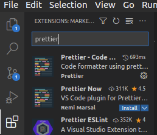

## Temas e iconos

Existen numerosas extensiones que nos permiten personalizar el aspecto de nuestro editor. Podemos tanto cambiar el tema de colores como los iconos.

A la hora de los iconos, podemos encontrar Material Icon Theme, la cual es una de las más utilizadas por la comunidad. Esta extensión nos ofrece soporte para casi cualquier tipo de archivo, haciendo que, visualmente, sea muy fácil diferenciar el tipo de archivo según su extensión (si es .ts, .c++, .py, etc.)

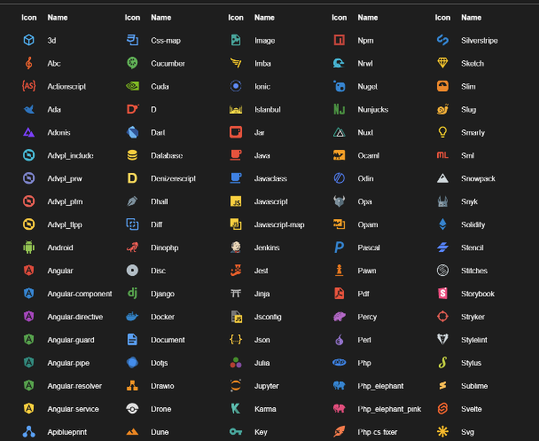

Cuando hablamos de temas, hay muchísima más variedad. Algunos de los más utilizados son los siguientes:

- [Monokai Pro](https://marketplace.visualstudio.com/items?itemName=monokai.theme-monokai-pro-vscode)
- [Atomized](https://marketplace.visualstudio.com/items?itemName=emroussel.atomize-atom-one-dark-theme)
- [Material Theme](https://material-theme.site/)
- [Cobalt2 Theme](https://marketplace.visualstudio.com/items?itemName=wesbos.theme-cobalt2)

Existen decenas de temas distintos, así que siéntete libre de probar todos hasta que encuentres tu favorito.

## Intellisense y snippets

VSCode también nos ofrece extensiones para que podamos trabajar de la mejor manera con los diferentes lenguajes de programación, framworks, librerias, etc. Estas extensiones ayudan al autocompletado de código y a aumentar nuestra velocidad programando, lo cual es esencial. Podemos encontrar:

- [Angular Snippets](https://marketplace.visualstudio.com/items?itemName=johnpapa.Angular2), para los que trabajan con este framework
- [ES7 React/Redux/GraphQL/React-Native snippets](https://marketplace.visualstudio.com/items?itemName=dsznajder.es7-react-js-snippets) y [Simple React Snippets](https://marketplace.visualstudio.com/items?itemName=burkeholland.simple-react-snippets), para los que utilizan React, React Native, GraphQL, etc.
- [C/C++](https://marketplace.visualstudio.com/items?itemName=ms-vscode.cpptools), añadiendo soporte de IntelliSense (autocompletado) para C y C++.
- [HTML CSS Support](https://marketplace.visualstudio.com/items?itemName=ecmel.vscode-html-css) y [HTML Snippets](https://marketplace.visualstudio.com/items?itemName=abusaidm.html-snippets), las cuales agilizan el desarrollo de código HTML y CSS.
- [JavaScript (ES6) code snippets](https://marketplace.visualstudio.com/items?itemName=xabikos.JavaScriptSnippets), para el desarrollo con JavaScript y TypeScript.

## Formateo de código

Esta sección es realmente importante, ya que darle formato a tu código es algo que puede llevar mucho tiempo y ser bastante tedioso. Con los formateadores de código, nos olvidamos de esta tarea, ya que serán estos los que den formato a todo nuestro archivo según las reglas que les predefinamos. Existen formateadores de código para prácticamente todos los lenguajes (por ejemplo, C/C++ para C y C++), aunque en este taller mostraremos Prettier, uno de los más usados (para JavaScript y TypeScript).

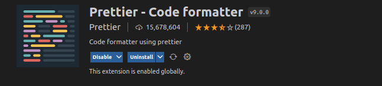

[Prettier](https://marketplace.visualstudio.com/items?itemName=esbenp.prettier-vscode) es, sin lugar a dudas, una de las mejores extensiones que nos ofrece VSCode, siendo esta utilizada por millones de personas, ya que hace que no sea necesario formatear código manualmente. Una vez instalada, podemos ir a los ajustes con `Ctrl+,`, y configurar Prettier a nuestro gusto.

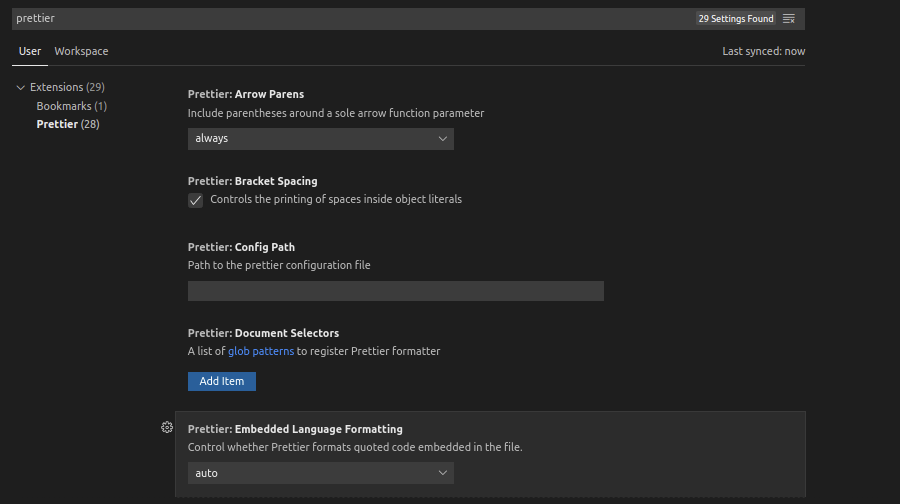

Podemos elegir si incluir parentesis en funciones de flecha con 1 solo parámetro, si usar siempre `""` o `''`, añadir automáticamente los `;` al final de cada línea, controlar el espaciado en objetos, el tamaño de línea, la indentación, etc. Para poder usar Prettier, basta con (dentro de nuestro archivo .ts/.js) utilizar el comando `Ctrl+Shift+I`, y automáticamente el código se ajustará a las reglas que hayamos definido en la configuración de Prettier.

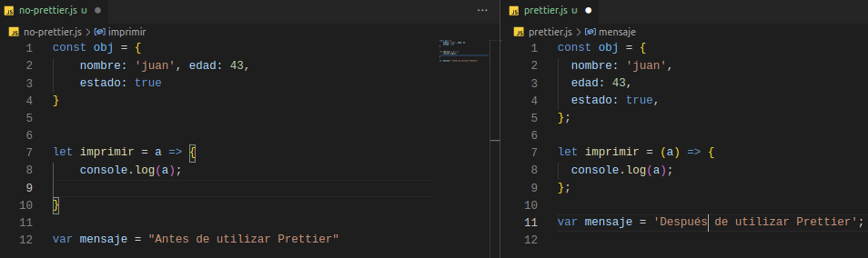

También existe la opción de que, siempre que guardemos los cambios realizados en un archivo, se aplique automáticamente el formateo de código. Para ello existe la opción **Format On Save**, la cual permitirá que Prettier o cualquier otro formateador de código actúe tan pronto como guardamos los cambios. Así, nos ahorraríamos tener que utilizar el comando `Ctrl+Shift+I` cada vez que queramos formatear el código de nuestro archivo.

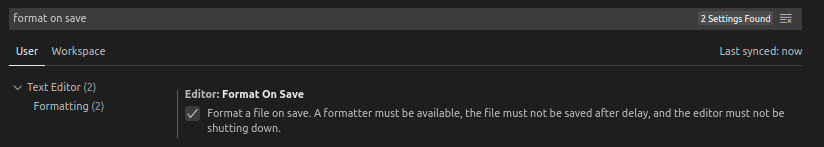

## Otras extensiones

### Live Share

[Live Share](https://visualstudio.microsoft.com/es/services/live-share/) nos permite editar archivos y código de forma colaborativa en tiempo real, independientemente del lenguaje de programación o de los ajustes de nuestro editor. Esta forma de colaboración es tremendamente útil, ya que permite crear sesiones donde otros programadores pueden unirse desde sus propios equipos, y así poder trabajar sobre el mismo código a la vez.

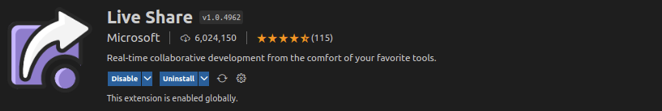

### Docker

[Docker](https://code.visualstudio.com/docs/containers/overview) también tiene su cabida en VSCode, ya que cuenta con una extensión la cual nos ayuda a construir, manejar y desplegar contenedores de una forma intuitiva y sencilla.

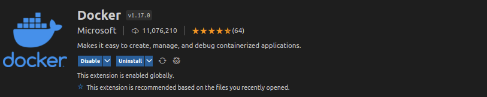

### Todo

Un TODO es una tarea que tenemos por hacer. Trabajar en VSCode utilizando los TODO es interesante a la hora de tener localizadas en tu código las funciones o características que queramos añadir. Podemos utilizar 2 extensiones:

- [TODO Highlight](https://marketplace.visualstudio.com/items?itemName=wayou.vscode-todo-highlight): Esta extensión nos resalta las secciones de nuestro código en la que hayamos escrito `TODO`, para así poderlos localizar más facilmente.

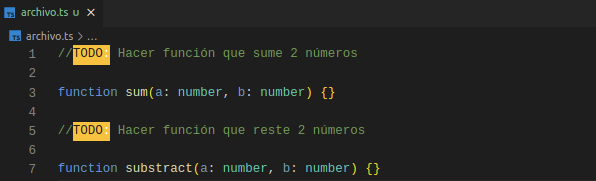

- [TODO Tree](https://marketplace.visualstudio.com/items?itemName=Gruntfuggly.todo-tree): Si quisieramos ver todos los TODO que tenemos en nuestro espacio de trabajo, esta extensión nos mostraría un listado de ellos, para que sea más fácil encontrarlos y acceder a ellos.

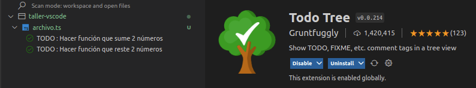

### Bookmarks

[Bookmarks](https://marketplace.visualstudio.com/items?itemName=alefragnani.Bookmarks) nos ofrece prácticamente lo mismo que un TODO. Un bookmark consiste en una etiqueta que podemos añadir a cualquier línea de nuestro código mediante el comando `Ctrl+Alt+K`, para poder volver a ella más fácilmente. Al igual que con TODO Tree, podemos acceder a una pestaña donde veamos todos los bookmarks que hemos añadido a los diferentes archivos de nuestro espacio de trabajo.

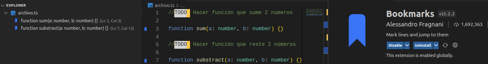

### Bracket pair colorization

Hasta hace apenas unos meses, esta extensión nos permitía identificar las parejas de paréntesis, corchetes o llaves mediante colores. Sin embargo, VSCode incluyó esto dentro de sus propios ajustes, por lo que merece la pena comentar como configurarlo.

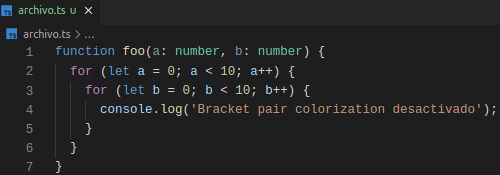

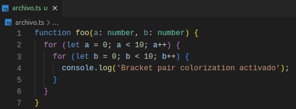

Sólo hay que busca en ajustes **Bracket pair colorization** y activar la opción para que VSCode nos ofrezca esta funcionalidad.

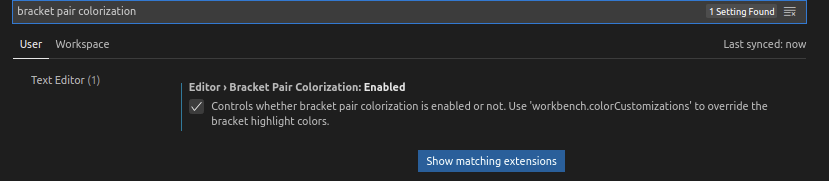

## Configuraciones extra

Para finalizar, hemos de tener en cuenta que existen numerosos ajustes que podemos cambiar y modificar para asemejar VSCode lo máximo posible a nuestros gustos. No cubriremos todos en este taller ya que, al haber tantos, sería imposible.

No obstante, cabe destacar que podemos acceder a un archivo llamado `settings.json`, donde encontraremos muchos de los ajustes que hemos ido haciendo a lo largo del taller, y donde podremos también añadir o modificar algunos nuevos. Para acceder a él, introducimos el comando `Ctrl+K Ctrl+S` para buscar el comando que le corresponde. Escribimos arriba `settings.json` y, en nuestro caso, nos muestra que no existe comando para acceder a él. Utilizar el comando que nosotros queramos (siempre y cuando no esté ya ocupado). Podemos elegir, por ejemplo, el siguiente comando: `Ctrl+Shift+J`.

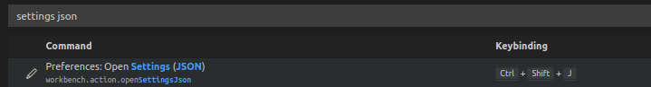

Una vez introducido el comando, ya podremos acceder al archivo `settings.json` donde podemos configurar varios parámetros como la fuente, el tipo y el tamaño de letra; y por el contrario también podemos ver ajustes que ya realizamos anteriormente como los ajustes de Prettier y otros más.

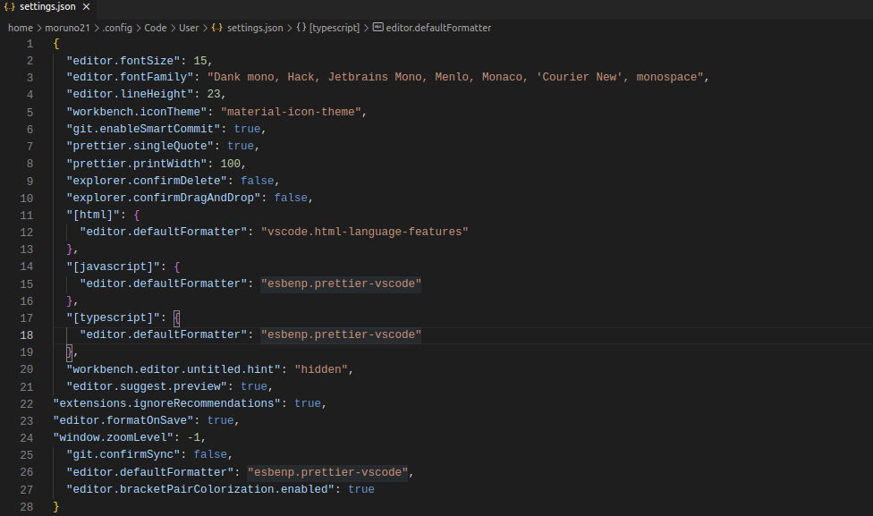
