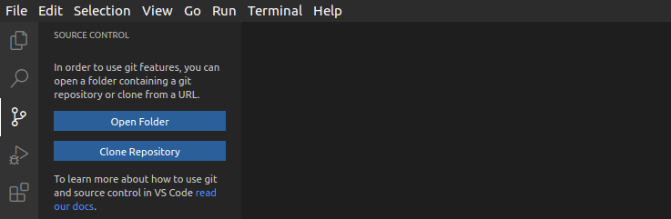
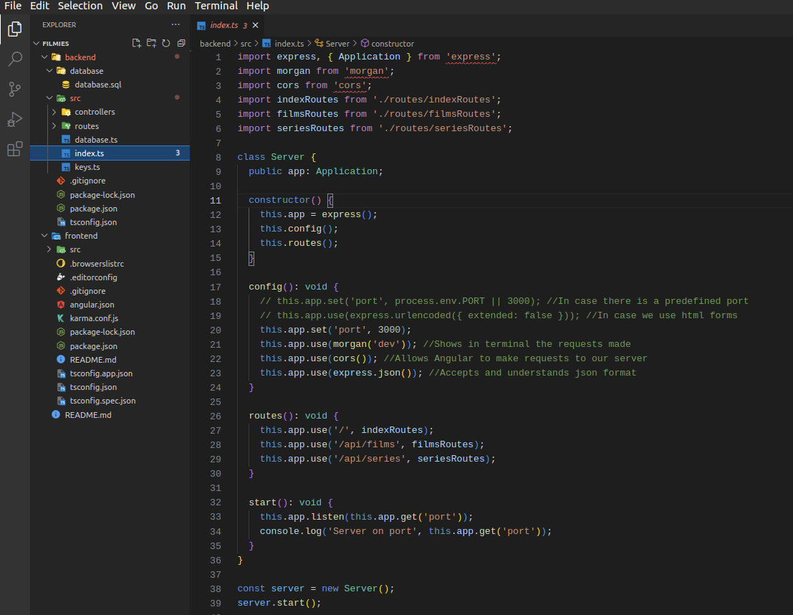
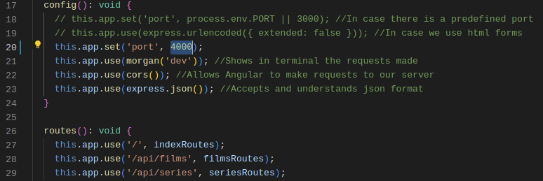
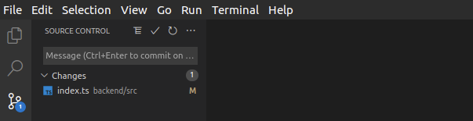
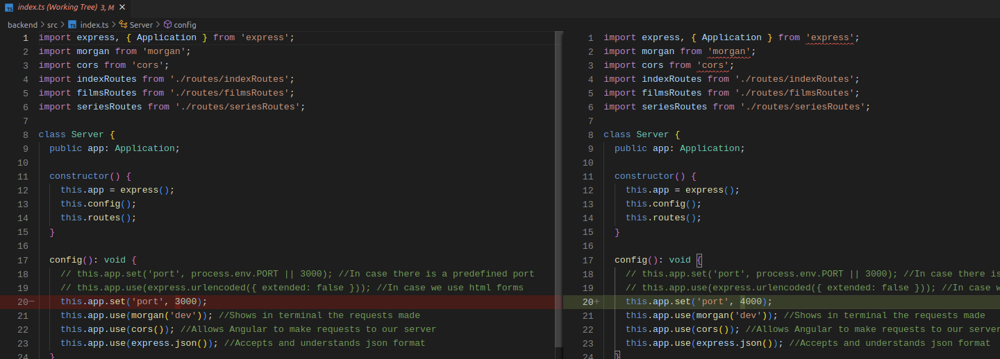
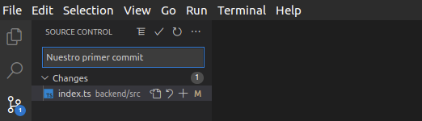

# Integración con git

En esta sección del taller, vamos a integrar git con VSCode, lo cual es muy útil y nos ayuda a tener todo en un mismo entorno.

Lo primero que debemos hacer es tener git instalado. Tenemos otro [taller](https://aulasoftwarelibre.github.io/taller-de-git/) donde se explica git en profundidad, desde lo más básico a los aspectos más avanzados. Será necesario conocer la terminología que utiliza git para saber manejarlo en VSCode.

## Clonar el repositorio

Ya habiendo instalado git, accedemos a la pestaña que nos aparece en la barra lateral izquierda. Nos saldrán 2 opciones:

- Abrir una carpeta: Podemos abrir una carpeta donde ya se encuentre inicializado un repositorio.
- Clonar un repositorio: Nos saldrá un mensaje que nos pedirá la url que nos da GitHub cuando queremos clonar un repositorio, y se nos inicializará donde seleccionemos.

## Trabajando con git

Cuando hayamos abierto la carpeta en la que tenemos nuestro repositorio, ya podremos trabajar con git dentro de nuestro editor.

Imaginemos que tenemos el siguiente proyecto abierto y que hemos realizado cambios en el archivo index.ts.

En nuestro ejemplo, simplemente vamos a cambiar el puerto en el que se nos abre por defecto del 3000 al 4000.

Después de guardar los cambios, al acceder a la sección de git dentro de VSCode podremos ver todos los archivos que han sido modificados. Vemos que VSCode nos muestra el archivo index.ts que acabamos de cambiar.

Podemos tanto deshacer los cambios del archivo, como ver que es lo que hemos modificado haciendo click en él.

## Confirmar y subir cambios

Para realizar un commit, aquí no es necesario hacer ningún **git add** ni nada por el estilo. Simplemente bastaría con escribir el nombre de nuestro commit encima de donde aparecen todos los archivos que hemos modificado y pulsar **Ctrl+Enter**.

También podemos hacer un **git push**. Para ello, desplegamos el menú de opciones dentro de nuestra pestaña de git en VSCode, y seleccionamos la opción **Push**. Esto subirá todos los commits que hayamos confirmado a GitHub.

En este taller pretendemos introducir esta integración y explicar brevemente su funcionamiento básico. Aún así, hay que tener en cuenta que VSCode ofrece muchas funcionalidades aún más avanzadas de git y que pueden realizarse perfectamente desde el editor, como mergear, usar tags, deshacer commits, etc. No cubriremos todas en este taller ya que sería demasiado extenso.
