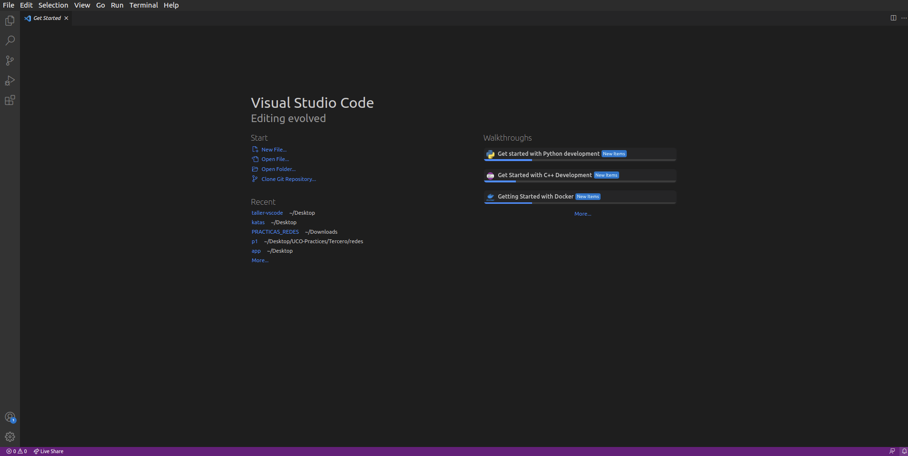

# Introducción

Visual Studio Code es un editor de código de software libre que fue desarrollado por Microsoft en 2015. Es multiplataforma y cuenta con numerosas funcionalidades que le colocan como uno de los editores más usados por programadores de todo el mundo. Entre algunas de sus características, encontramos soporte para el autocompletado de código, comandos que agilizan el desarrollo, integración con el control de versiones git, entre otras.

Además, cuenta con soporte para numerosos lenguajes, entre los cuales se encuentran los más usados a nivel mundial como JavaScript, C, C++, PHP, Python, etc. También posee una interfaz muy intuitiva, la cual nos ayuda a que la experiencia de escribir código se haga lo más agradable posible.

En este taller, trataremos las funcionalidades más importantes de VSCode, intentando exprimir al máximo su potencial y configurando un entorno de desarrollo lo más óptimo posible.

## Descarga

Para descargarlo, podemos acceder a la tienda de aplicaciones que poseen algunas distribuciones como Ubuntu. Esto es lo más rápido y sencillo. Aún así, también podemos descargar el editor desde la [página web oficial](https://code.visualstudio.com/).

En cuanto lo tengamos descargado e instalado, podemos iniciarlo y se nos mostrará la interfaz del editor.

Tenemos en la barra superior las opciones básicas con las que cuenta cualquier editor, para abrir y cerrar archivos, editar, etc. Además, en la barra de la derecha nos aparecerán por defecto 5 iconos:

- Explorador: Ahí se nos mostrarán los archivos contenidos en nuestro espacio de trabajo.
- Buscador: Podemos buscar términos a través de todos los archivos de nuestra carpeta en esta sección, obteniendo todos los resultados encontrados en los diferentes archivos.
- Git: Integración con git. Lo explicaremos más adelante.
- Depurador: Utilizado para encontrar los errores de nuestro código.
- Extensiones: Herramientas que nos aportan funcionalidades adicionales para desarrollar nuestro código. Mostraremos las más relevantes a lo largo del curso.

## Comenzando con el taller

Para comenzar con el taller, abriremos un archivo donde podamos aplicar los diferentes comandos y atajos que se enseñarán en la primera sección del curso. Para ello, podemos abrir directamente un archivo con **Ctrl+O**, una carpeta con **Ctrl+K Ctrl+O**, o podemos crear el archivo con **Ctrl+N**.

<!-- Para este taller, es recomendable descargar [esta carpeta](), para poder trabajar con los mismos ejemplos a la vez que se sigue la documentación. -->
